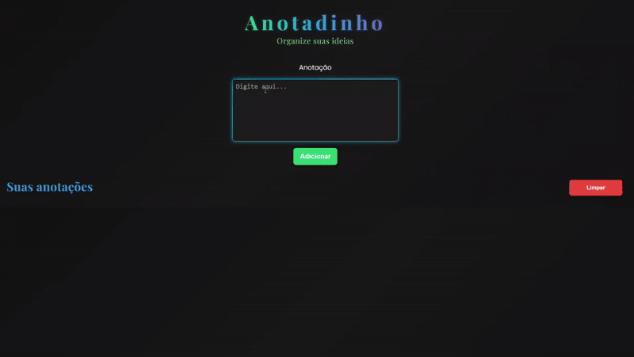

# Notas Rápidas 📒

## Sobre o projeto
Um aplicativo onde você pode adicionar suas anotações diárias, sem limite de quantidade, onde o usuário pode criar, listar, e excluir notas. Inicialmente o projeto funcionava apenas no frotnend, mas agora foi atualizado para incluir um backend em Node.js com Express, permitindo salvar e gerenciar os dados via API. 

## Desafios
Este projeto foi uma experiência muito enriquecedora! O principal desafio foi reorganizar a estrutura do JavaScript. Depois de implementar todas as funcionalidades, percebi a necessidade de refatorar o código para deixá-lo mais limpo, legível e fácil de manter. Para isso, separei trechos repetidos em funções e deixei a lógica mais modularizada.

Outra etapa desafiadora foi adicionar o backend: criar e estruturar uma API do zero exigiu atenção extra, especialmente na comunicação entre o frontend e o backend, mas foi uma parte importante para evoluir minhas habilidades.

## Projeto no ar
Acesse a versão online do [projeto](https://luciane003.github.io/App-Notas/)

## Repositório do backend
[Clique aqui](https://github.com/luciane003/App-Notas-backend)

## Funcionalidades
- Layout totalmente responsivo
- Ao clicar na caixa de anotação, surge um efeito de brilho azul
- Botão “Adicionar” para inserir novas anotações
- Botão “Limpar” para remover todas as notas de uma vez
- Efeito de brilho azul leve ao passar o mouse sobre as notas
- Cada nota possui um botão “x” para exclusão individual.
- Desenvolvido com HTML, CSS, JavaScript e um backend em Node.js/Express.

## Tecnologias usadas
### Frontend

  
  
  

 

### Backend

  
  
  
  

## Como visualizar o projeto frontend localmente
### Clonar o repositório
git clone https://github.com/luciane003/App-Notas.git

## Como rodar o projeto com backend local
- Inicie o servidor: `npm run dev` (ou o comando que usa)
- Depois abra o frontend no navegador(live Server ou Vite dev)
- O frontend se comunica com : http://localhost:3000/anotacoes

## Visualização

## Autora 
-  Luciane Kellen
- Feito como parte do meu processo de aprendizagem.

  
  
  

